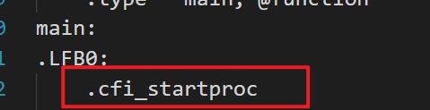
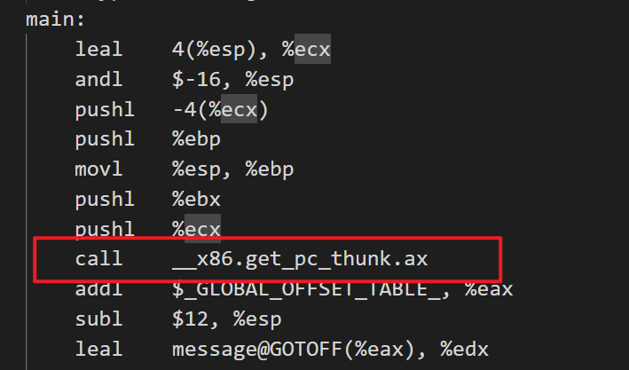

# gcc汇编分析

在test目录中编写`hello.c`文件：
```C
#include <stdio.h>

char message[] = "hello, world!";   // data
char undefine[1024];                // bss

int main() {
    printf(message);
    return 0;
}
```
在对应的Makefile中编译为汇编文件：
```Makefile
hello.s: hello.c
	gcc $(CFLAGS) -S $< -o $@
```

## CFI
当`CFLAGS = -m32`时，编译产生的汇编代码`hello.s`中有：


CFI: Call Frame Information 调用栈帧信息

是一种DWARF的信息，用于调试，获得调用异常，gcc可以加上编译条件：

    -fno-asynchronous-unwind-tables

来去掉这些信息。

## PIC
编译时自动生成的代码是：

Position Independent Code 位置无关代码

在加上`-fno-asynchronous-unwind-tables`后编译生成的`hello.s`没有了CFI信息，在`main`函数中有一个函数调用：


    call	__x86.get_pc_thunk.ax

作用是获取寄存器`eip`的值，是CPU的指针寄存器 extend instruction pointer，然后将`epi`的值给寄存器`eax`，相当于：
    mov eax, eip

后面执行：
```S
	call	__x86.get_pc_thunk.ax
	addl	$_GLOBAL_OFFSET_TABLE_, %eax
```

从而得到`_GLOBAL_OFFSET_TABLE_`，全局符号偏移表，像`hello.c`中的`message`，`main`函数等就是符号，因为是位置无关的代码，所以其存放的内存地址不确定，就有这个表来标识位置。

如果不需要位置无关的代码，gcc加编译选项：
    -fno-pic

## ident
在`hello.s`中出现了
    
	.ident	"GCC: (Ubuntu 11.4.0-1ubuntu1~22.04.2) 11.4.0"

这个是编译的gcc的版本信息，可以直接用gcc指令
    -Qn
来去掉这个信息。

## 栈对齐
在main函数最开始，有：
    main:
	leal	4(%esp), %ecx
    andl	$-16, %esp

-16 = 0xfffffff0

作用是将栈与16字节对齐，内存对齐的作用与结构体内存对齐的作用一样，都是让CPU用更少的时钟周期访问运行。用
    -mpreferred-stack-boundary=2
来取消栈的内存对齐。

## 栈帧

在汇编中的`main`函数中，开头与结尾是：
    pushl	%ebp
	movl	%esp, %ebp
    ...
    leave

- `%ebp`：栈基址寄存器，固定指向当前函数栈帧底部(高地址端--栈从上向下生长)，用来定位参数/局部变量
- `%esp`：栈顶寄存器，指向栈帧的顶部(低地址端)。
- `pushl %reg` : 将寄存器reg的值压入栈中->%esp -= 4，值存入%esp指向的地址
- `popl %reg` : 从栈顶取值到寄存器->值从`%esp`取出，$esp += 4

所以:
    pushl	%ebp        ; 步骤1，保存上一层函数的栈帧基址
	movl	%esp, %ebp  ; 步骤2，esp的值->ebp，将当前栈顶设置为当前函数的栈帧基址
    ...
    leave

`leave`相当于：
    movl %ebp, %esp ; 步骤1，恢复栈顶到栈帧基址
    popl %ebp       ; 步骤2，恢复调用者的栈帧基址到%ebp

可以用
    -fomit-frame-pointer
来取消栈帧。**只是放弃用%ebp做栈帧基址，改用%esp直接寻址，栈本身依然存在，函数调用的核心逻辑（参数传递、返回地址、局部变量）完全没丢**。

## 综合解析
```S
	.file	"hello.c" # 文件名
.text                 # 代码段
	.globl	message   # 将数据message导出
.data                 # 数据段
	.align 4          # 按四字节对齐
	.type	message, @object # message的类型
	.size	message, 14     # message的尺寸
message:
	.string	"hello, world!"
	
.globl	undefine # undefine数据
	.bss        # 在bss段
	.align 32   # 按32字节对齐
	.type	undefine, @object
	.size	undefine, 1024 # 预留了1024字节的位置给undefine
undefine:
	.zero	1024    # 初始化为0
.text   # 回到代码段
	.globl	main # main函数
	.type	main, @function
main:
	pushl	$message    #message压入栈中
	call	printf      # 调用printf
	addl	$4, %esp    # 恢复栈
	movl	$0, %eax    # 函数返回值为0，存储在eax寄存器
	ret     # 函数调用返回
	.size	main, .-main
	.section	.note.GNU-stack,"",@progbits # 标记栈不可运行
```